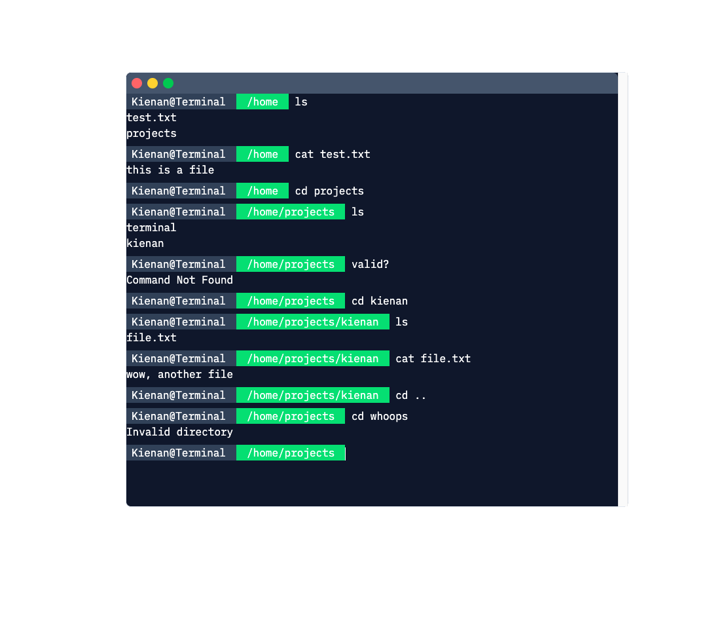

# Svelte-Terminal

## WIP

### Svelte library for a simple browser terminal



## Features

* ### Custom Commands
    * Command validation
    * Numerous default commands

```
const allCommands = [
	changeDirectoryCommand,
	clearCommand,
	listDirectoryCommand,
	testCommand,
	printCommand
];
export const commands = new Commands(terminal);
commands.addCommands(allCommands);
```

```
function testCommandFn(state: Terminal, parameters: Parameter[]) {
	const paramsAsOutput = parameters.reduce((p, c) => {
		p += c.name + ' = ' + c.value + '\n';
		return p;
	}, '');
	state.createMessage('Test Command Ran with Params -\n' + paramsAsOutput);
}

const testCommand = {
	name: 'test',
	description: 'Test output',
	alias: ['test', 'ts'],
	parameters: [
		{
			name: 'name'
		}
	],
	fn: testCommandFn
} as Command;

export default testCommand;
```

---

* ### Simple file system
    * Convert from JSON

---

```
const fileSystemMap: FileSystemInput = {
	home: {
		'test.txt': {
			contents: 'this is a file'
		},
		projects: {
			terminal: {},
			kienan: {
				'file.txt': {
					contents: 'wow, another file'
				}
			}
		}
	}
};

export const fileSystem = new FileSystem(fileSystemMap);
```
